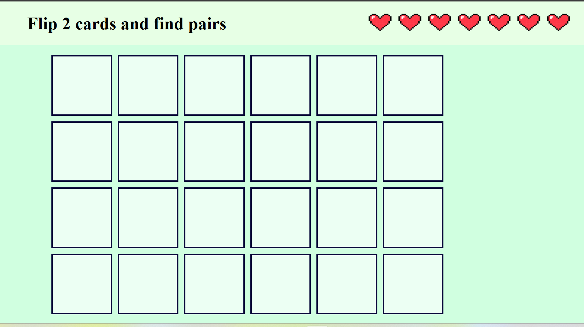

# Animal memory game 

_a concentration game that will tests your memory finding pairs of cute animals.The rules are very easy, just flip 2 cards, and if they matched they will stay revealed. If their mismatched, they will flip back over. You have only 7 lives and you should find the pairs before you lose all your lives._



## Getting Started

### Play the Game

[Deployed Game Link](https://github.com/bynbdulla/concentration-game)


### How to Play

1. **Start the Game**: The cards are hidden, and they are automatically shuffled when you open the page. 
2. **Your first move**: Click on any 2 cards and they will reveal 
3. **Find the pair**: If the 2 cards are matching, then the cards will stay visible. 
4. **The lives**: Be careful that you have only 7 lives. Whenver you mismatch the cards you will lose one life. 
5. **Win**: When you find all the matching pairs, then you win.
6. **Restart**: Use the restart button to play again with shuffled cards. 

### Installation

No installation required! Simply clone the repository to your local machine and open the `index.html` file in your favorite browser to start playing.

```bash
git clone https://github.com/bynbdulla/concentration-game
cd concentration-game
open index.html
```

### Technologies Used

- **HTML**: For structuring the game content.
- **CSS**: For styling and animating the game interface.
- **JavaScript**: For game logic and interactivity.

### Future Enhancements

- adding score 

### Credits


### License

This project is licensed under the MIT License - see the [LICENSE.md](LICENSE.md) file for details.